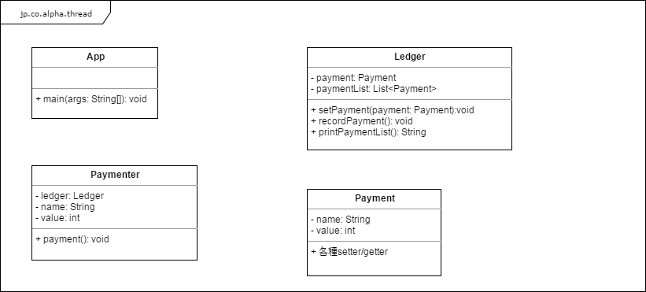

# Servlet講習


>>>>
## まずはスレッドを簡単に学ぼう

----
### コンソールアプリでスレッドを体験
以下の3人から、同じ台帳に支払情報を連続12回記録する。
* こたろう  ： 1回の支払額100万円
* こてつ    ： 1回の支払額50万円
* こじろう  ： 1回の支払額20万円

というアプリを作りましょう。

----
### クラス構成
以下のようなクラス構成で作っていこう。  
中身の処理は後で作るとして、まずは以下クラスを作って見て。  
※アプリを作る中で不足していると思うところは適宜追加すること。
<!-- .element height="80%" width="80%" -->

----
### アプリ作成（１）
まずは、こたろうが支払情報を記録するまでを作って見よう。  
手順は以下かな。
* Appの処理
  * Ledgerのインスタンスを１つ生成。
  * Paymenterのインスタンスを1つ生成。
    * ledgerフィールドに先ほど生成したLedgerのインスタンスを設定
    * nameフィールドに"こたろう"を設定
    * valueフィールドに100を設定
  * Paymenterのpaymentメソッドコール
  * LedgerのprintPaymentListメソッドコール

----
### アプリ作成（２）
続き
* Paymenterのpaymentメソッドの処理
  * 以下の処理を12回繰り返す。
    * Paymentのインスタンスを一つ生成
      * nameとvalueフィールドにPaymenterの値を設定
    * ledgerのsetPaymentメソッドコール
    * ledgerのrecordPaymentメソッドコール

----
### アプリ作成（３）
続き
* LedgerのsetPaymentの処理を作成。
  * paymentフィールドに引数を設定
* LedgerのrecordPaymentの処理を作成。
  * paymentフィールドをpaymentListに追加。
* LedgerのprintPaymentListの処理を作成。
  * paymentListの内容をすべてsysout。

----
### アプリ作成（４）
ここまでで、こたろうが支払情報を記録するところまで出来たはず。  
このあと、AppクラスのPaymenterの生成処理を複製して、のこり2人を同じように追加しよう。  
出来たら実行しよう。  
3人が12回ずつ、順番に台帳（Ledger）に支払いを記録しているのが確認できるだろうか？

----
### アプリ作成（５）
ただ、これだと、順繰りに処理してるだけで、全然スレッドじゃない。  
3人を平行して処理したい。  
PaymenterにRunnableを実装（implements）しよう。  
そして、Appクラスでスレッドを生成して、3人が平行して処理するように改造しよう。  
スレッドは、以下を参考に作るとよいよ。  
```
// スレッド作成
Thread th1 = new Thread(paymenter1);
// スレッドの開始
th1.start();
// スレッドの終了待機
th1.join();
```

>>>>
## Java Servletを簡単に学ぼう

----
### Webプロジェクトを作成
まずは、MavenでWebプロジェクトを作りましょうか。  
一緒に作っていきましょう。

----
### ハローサーブレットを作成
凄く簡単なJavaサーブレットを一個作りましょう。  
URL叩くとハローっていいます。  
一緒に作っていきましょう。

----
### カウンターサーブレットを作成
訪問カウンタを表示するJavaサーブレットを作りましょう。  
URL叩くとカウントアップしてカウンタを表示します。  
一緒に作っていきましょう。  
で、みんなで、だれか一人のカウンターサーブレットにアクセスしてみよう。

----
### スコープについて学ぼう（１）
以下のJavaファイルと、JSPファイルを作ろう。
* jp.co.alpha.handson.servlet.ScopeTestServlet
* /src/main/webapp/view/scope/show.jsp
* /src/main/webapp/view/scope/input.jsp

----
### スコープについて学ぼう（２）
ScopeTestServletの中身を以下手順で作ろう。
* doGetメソッドをオーバーライド
 * パスによって以下のようにforward（遷移）するように処理作成
  * パス「scope/」の場合、show.jspへ遷移する
  * パス「scope/input」の場合、input.jspへ遷移する
* doPostメソッドをオーバーライド
 * show.jspへ遷移するように処理作成

画面遷移のコーディングは以下のように。
```
req.getRequestDispatcher("/view/scope/input.jsp").forward(req, resp);
```

----
### スコープについて学ぼう（３）
show.jspを作ろう。
```
<%@ page language="java" contentType="text/html; charset=UTF-8"
	pageEncoding="UTF-8"%>
<html>
<body>
	<h2>スコープテスト</h2>
</body>
</html>
```
これが出来たら、サーバを起動して、パス「scope/」にアクセスし、show.jspの画面を見てみよう。

----
### スコープについて学ぼう（４）
input.jspを作ろう。  
<body>タグ前後は、show.jspと同じ、<body>タグの中は以下で。
```
	<h2>スコープ設定</h2>
	<form method="post" action="send">
		<input type="submit" value="送信">
	</form>
```
これが出来たら、サーバを再起動して、パス「scope/input」にアクセスし、input.jspの画面を見てみよう。  
送信ボタンがあると思うので、それ押して。  
押したらshow.jsp画面が出ただろうか？出たならOK。

----
### スコープについて学ぼう（５）
ここからは、サーブレットとJSPを弄り倒してスコープというものを学んでもらうのだけど…  
プレゼン作るのがもう面倒だ。ここからは一緒にやってこう。

